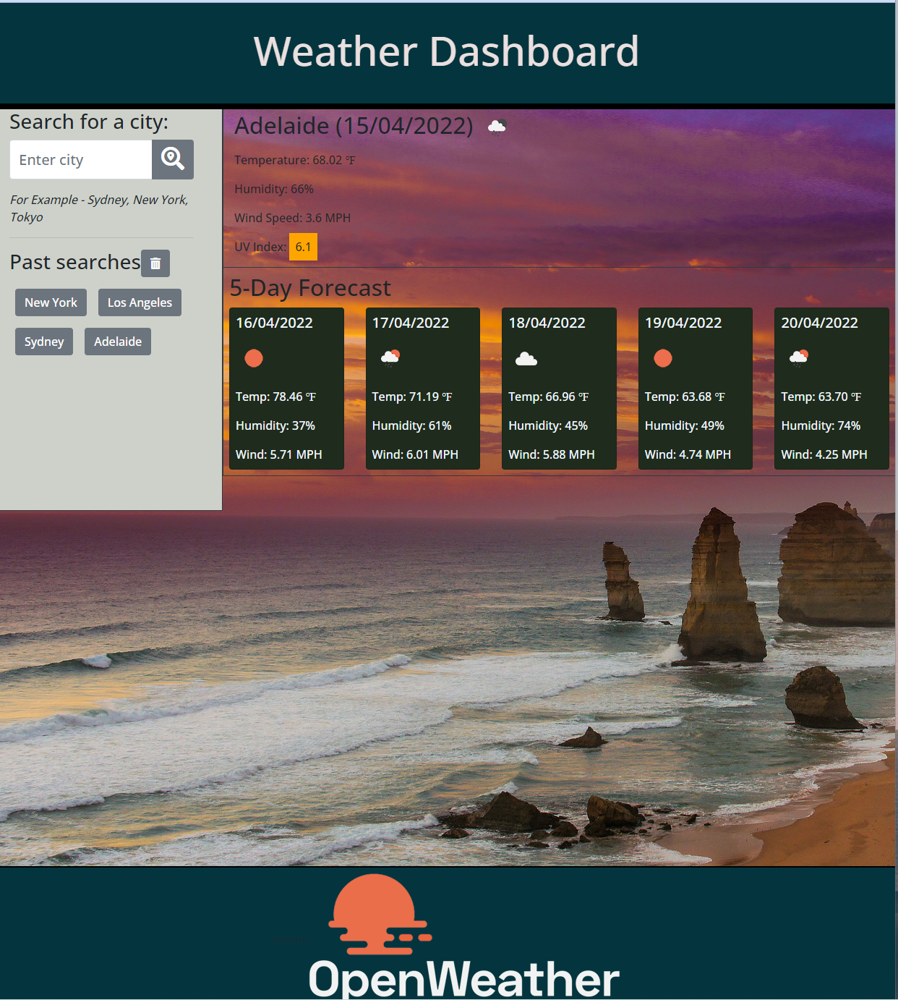
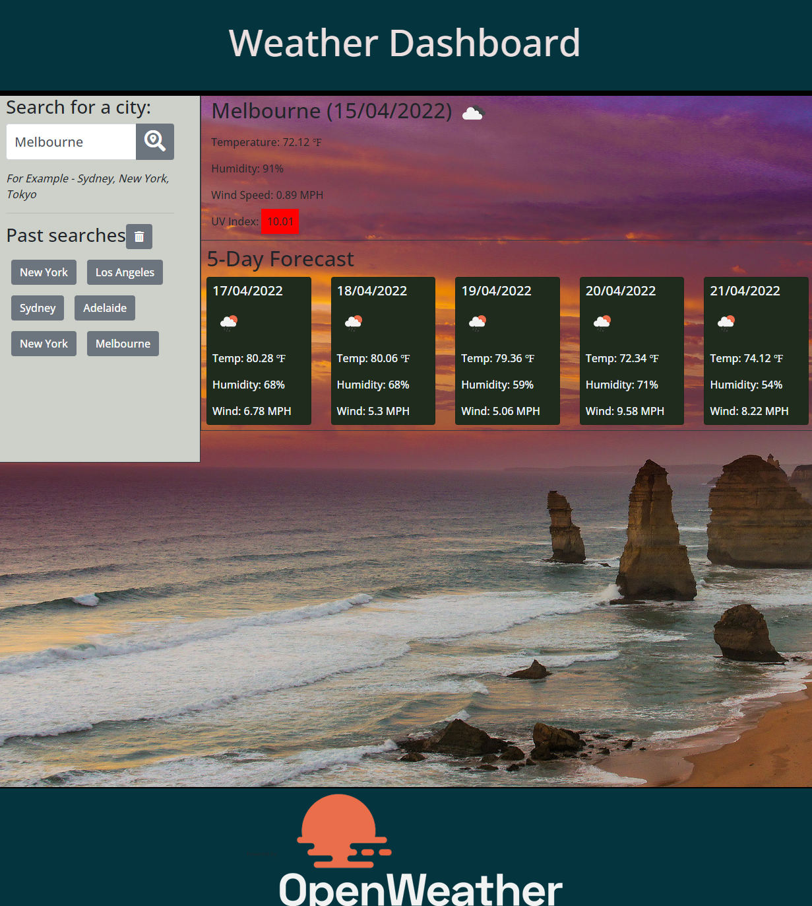
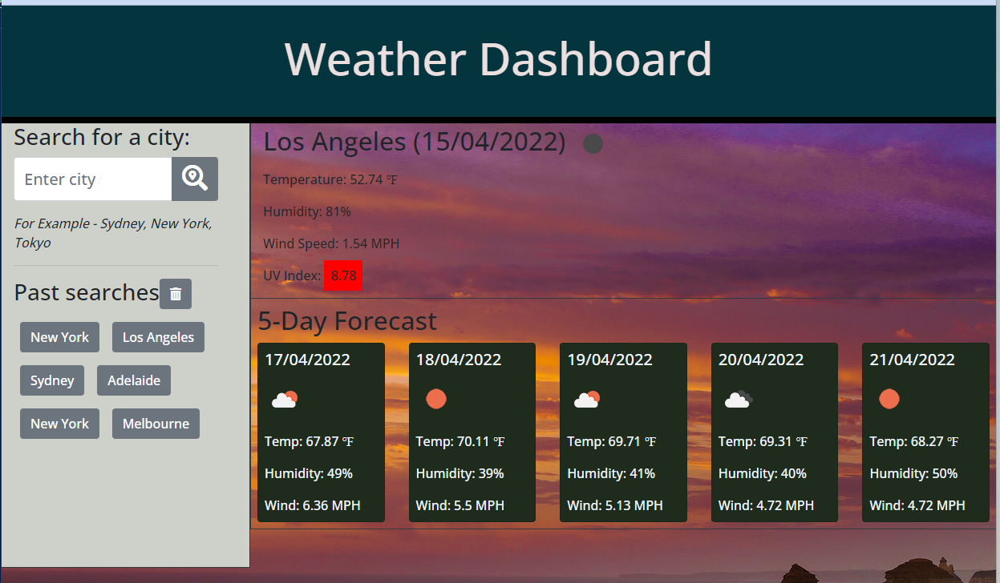
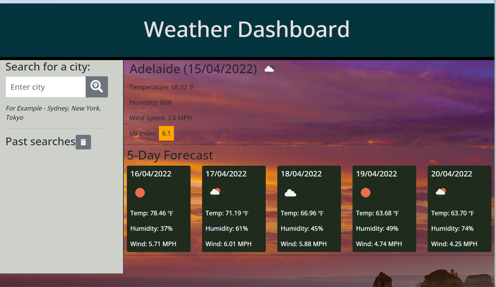

## TASK
The task here is to build a weather dashboard so that the user (the traveller) would be able to see the weather outlook for multiple cities and plan their trip accordingly. Overview of the weather dashboard:-

 

## ACCEPTANCE CRITERIA

The steps taken to meet the acceptance criteria of:-

```
GIVEN a weather dashboard with form inputs
WHEN I search for a city
THEN I am presented with current and future conditions for that city and that city is added to the search history
WHEN I view current weather conditions for that city
THEN I am presented with the city name, the date, an icon respresentation of weather conditions, the temperature, the humidity
WHEN I view the UV index
THEN I am presented with a color that indicates whether the conditions are favorable, moderate or severe
WHEN I view future weather conditions for that city
THEN I am presented with a 5-day forecast that displays the date, an icon representation of weather conditions, the temperature and humidity
WHEN I click on a city in the search history
THEN I am again presented with the current and future conditions for that city
```
1)  In the WEATHER-DASHBOARD folder, I have created the following files:-

    * index.html - the structure of the landing page following closely the Mock-up given
    * style.css - the styling page where I keep the custom page.  Bootstrap was used.
    * script.js - for carrying out the functions to meet the required criteria

2) Free images were obtained from :

    Microsoft Bing free image (The Twelve Apostles, Victoria) was used as a background image.
    <br>
   
3) The below screenshots show the process the user would go through to see the current and future weather conditions for the chosen city.


#### <em>Search for a city</em> 
    Enter the city in the form input for "Search for a city" will bring on the weather conditions for that city, 5-day forecast, UV index and all required criteria.


       
#### <em>Searched results are saved</em> 
    The searched city is saved or stored in search history. The traveller can view the past searches by clicking on the button for the searched city.



#### <em>Past searches can be cleared</em>
    The past searches can be cleared by the click on the bin icon and the default city is Adelaide. 
    



4) The layout is also responsive and caters for mobile, tablets and desktop. 

## DEPLOYMENT

The application is deployed on GitHub and the repository name is WEATHER-DASHBOARD.

The URL of the GitHub respository is :-

https://github.com/stellalph/WEATHER-DASHBOARD.git

The URL of the functional, deployed application is :-

https://stellalph.github.io/WEATHER-DASHBOARD/


## REFERENCES (other)

* Full Stack Blog on how to use APIs keys

* The materials from The Unit Ahead: Server-Side APIs

* https://www.arpansa.gov.au/our-services/monitoring/ultraviolet-radiation-monitoring/ultraviolet-radiation-index
